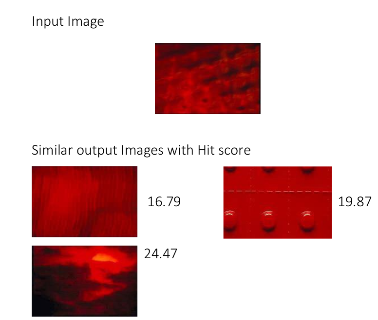

# LIRE Implementation
LIRE is a light weight open source Java library for content-based image retrieval. It provides common and
state of the art global image features and offers means for indexing and retrieval. Due to the fact that it
is based on a light weight embedded text search engine, it can be integrated easily in applications without
relying on a database server.

We will maintain an index structure using the Library Lucene Image Retrieval (LIRE) 1 framework. Therefore,
a Java class named IndexService is implemented. It acts as a facade to LIRE and
we have created following method using LIRE:
- InsertIndexs: It will insert new index in the index directory.
`insertIndex(String imageFilePath, String indexName)`
- removeIndex: It will remove all the index.
`removeIndex(String indexName)`
- ListAllIndexs: It will list all the index which are already created.
`listAllIndexes(String indexName)`
- listSimilarEntries: This function will find similar image in Corel dataset based on given
random chosen image.
`listSimilarEntries(String dirPath, int limit, String indexName)`
- createindexes: This function will create index by using lire wrapper for lucene indexWriter.
`createIndexes(String dirPath, String indexName)`

## Following image shows an outcome of listSimilarEntries implementation

